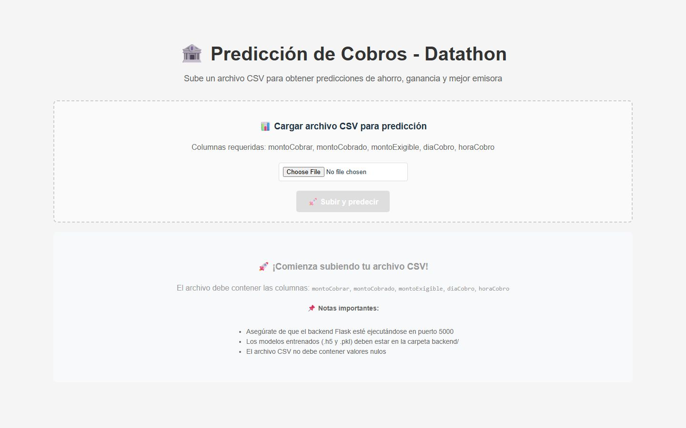
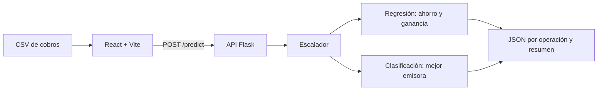

# Predicción de cobros (Datathon 2025)

Aplicación web que toma un archivo CSV de operaciones de cobro por domiciliación de Credifiel y devuelve predicciones por operación. Estima el ahorro y la ganancia, y recomienda la emisora con mejor resultado. Fue un proyecto en equipo para el Datathon 2025, pensado para ayudar a decidir dónde concentrar la cobranza.

**Autor:** [Hermann Pauwells Rivera](https://hermannpr.github.io/), trabajo en equipo.



## Características

- Carga de un CSV con las columnas `montoCobrar`, `montoCobrado`, `montoExigible`, `diaCobro` y `horaCobro`.
- Red neuronal de regresión para estimar ahorro y ganancia.
- Red neuronal de clasificación para recomendar la mejor emisora, con probabilidades.
- Resultados por operación en una tabla, con un resumen general.
- API REST en Flask con el endpoint `POST /predict`.

## Tecnologías

- Backend: Flask, Flask-CORS, pandas, TensorFlow, scikit-learn, joblib y NumPy.
- Frontend: React 19, TypeScript y Vite.

## Cómo funciona



## Cómo correrlo

Backend:

```bash
cd backend
python -m venv .venv
source .venv/bin/activate
pip install -r requirements.txt
python app.py
```

En Windows se activa con `.venv\Scripts\activate`. El backend corre en el puerto 5000.

Frontend, en otra terminal:

```bash
cd frontend
npm install
npm run dev
```

También hay scripts para Windows: `setup.bat`, `start_full_app.bat` y `run_server.bat`.

## Datos y modelos

Los modelos entrenados (`.h5` y `.pkl`) y el dataset real no se incluyen en el repositorio por confidencialidad. El archivo `backend/datos_ejemplo.csv` trae 10 filas sintéticas con el formato esperado. Sin los modelos, la API responde que no están cargados.

## Estado y licencia

Prototipo hecho para el Datathon 2025, probado a mano con datos de ejemplo y sin pruebas automatizadas. No tiene licencia declarada y el código se publica como portafolio.
