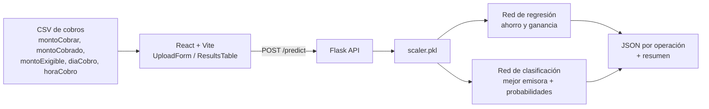

# CrediFiel Challenge: predicción de cobros (Datathon 2025)

> **ES:** Modelos de redes neuronales (regresión + clasificación) para optimizar la cobranza por domiciliación de Credifiel: estimar ahorro y ganancia por operación y recomendar la emisora con mejor resultado. API en Flask y frontend en React + Vite.
> **EN:** Neural-network models (regression + classification) to optimize direct-debit collections for Credifiel, served through a Flask API with a React + Vite frontend.

**Autor:** [Hermann Pauwells Rivera](https://hermannpr.github.io/) · proyecto en equipo, Datathon 2025

Aplicación para predecir ahorros, ganancias y mejores emisoras a partir de datos de cobros financieros.

## Overview

Proyecto de Data Science (Datathon) que toma un archivo CSV de operaciones financieras y devuelve predicciones de cobro para ayudar a decidir dónde concentrar esfuerzos. Combina un backend de predicción en Flask con un frontend React para subir, procesar y visualizar resultados.

## Tech Stack

- Backend: Flask, Flask-CORS, pandas, TensorFlow, scikit-learn, joblib, numpy.
- Frontend: React, TypeScript, Vite.
- Datos: archivos CSV (ver `backend/datos_ejemplo.csv`).

## Key Features

- API REST en Flask para procesar predicciones.
- Modelos de regresión y clasificación con TensorFlow / scikit-learn.
- Carga y análisis de archivos CSV.
- Frontend React con tablas interactivas de resultados.

## Getting Started

Scripts de Windows incluidos: `setup.bat` (instala y prepara), `start_full_app.bat` (arranca backend + frontend), `run_server.bat` (solo backend).

Manual:

```bash
# Backend
cd backend
python -m venv .venv && source .venv/bin/activate   # Windows: .venv\Scripts\activate
pip install -r requirements.txt
python app.py

# Frontend (en otra terminal)
cd frontend
npm install
npm run dev
```

## Status

Prototipo / proyecto de Datathon (2025). Verificación manual con datos de ejemplo; sin suite de pruebas automatizada.

## Cómo fluye una predicción



Los modelos entrenados (`.h5`, `.pkl`) y el dataset real no se incluyen en el repositorio por confidencialidad; `backend/datos_ejemplo.csv` trae 10 filas sintéticas con el formato esperado. Sin modelos, la API responde que no están cargados.

## Licencia

Sin licencia declarada; código publicado como portafolio.
